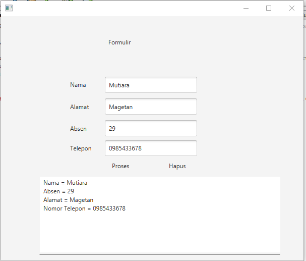

# Coba-proyek-1

1.program ini berfungsi untuk memasukkan atau menginput data, setelah data dimasukkan akan bisa tampil setelah di tekan 
tombol proses, dan juga dapat dihapus data tersebut dengan menekan tombol hapus.
